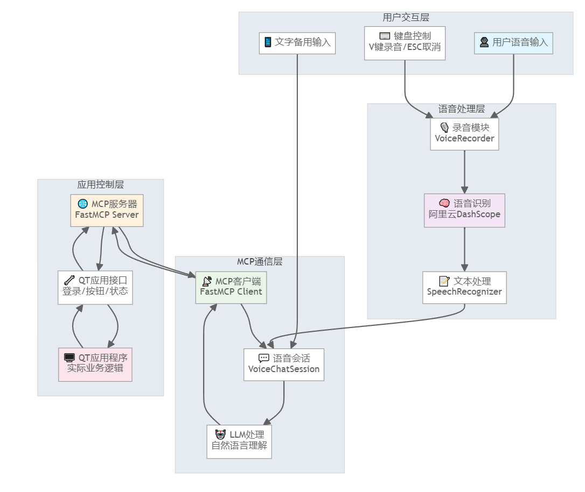
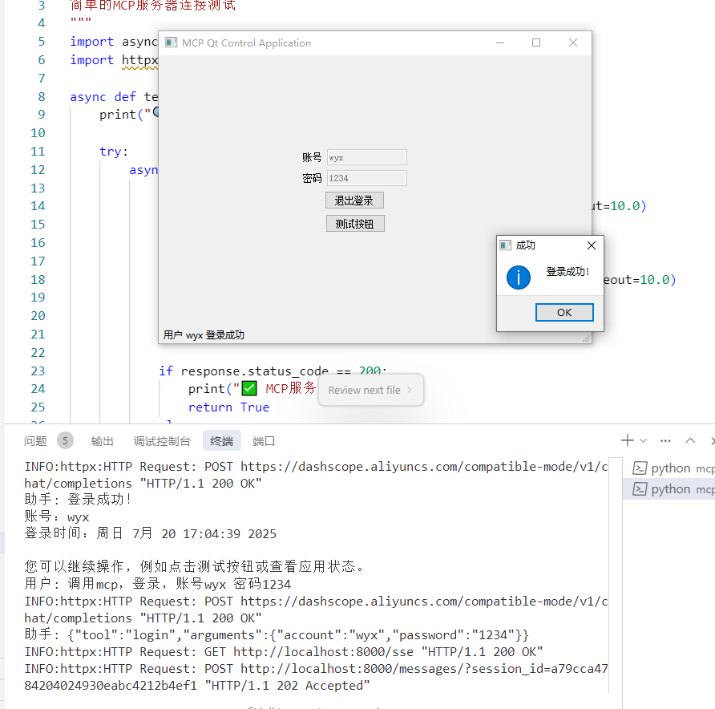

## AI控制QT应用程序完整方案

注：功能还在持续优化中。。。

## 设计框架图
整体框架图：


数据设计图：


## 实际效果
登录效果：


测试按钮效果：


获取状态效果：


### 📊 **整体架构概述**

上图展示了完整的语音控制流程，从用户语音输入到QT应用操作的全链路处理。

## 🧠 **1. 语音识别系统**

### 核心技术栈
- **录音引擎**: sounddevice + numpy
- **音频格式**: 16kHz单声道WAV
- **识别API**: 阿里云DashScope qwen-omni-turbo模型
- **处理框架**: 异步Python + httpx

### 关键特性
```python
# 语音识别核心流程
语音输入 → 音频录制 → 格式转换 → API识别 → 结果清理 → 文本输出

# 优化策略
- 静音检测：避免无效API调用
- 提示词优化：针对QT操作场景定制
- 结果清理：过滤API返回的冗余信息
- 错误恢复：识别失败时的降级处理
```

### 识别精度优化
```python
# 针对QT操作的专用提示词
qt_prompts = {
    'login': "将音频转为简短文字，只要指令内容：如'登录账号xxx密码xxx'",
    'button': "将音频转为简短文字，只要指令内容：如'点击测试按钮'",
    'general': "将音频转为简短文字指令，不要解释代码，只要用户说的话"
}
```

## 📡 **2. MCP客户端 (FastMCP Client)**

### 核心职责
- **协议通信**: 与MCP服务器建立SSE连接
- **工具管理**: 获取和调用可用的QT操作工具
- **会话管理**: 维护与LLM的对话状态
- **指令解析**: 将自然语言转换为结构化工具调用

### 关键实现
```python
# MCP客户端核心功能
class MCPClient:
    async def connect_to_server(self, url):
        # SSE传输协议连接
        # 默认: http://localhost:8000
        
    async def list_tools(self):
        # 获取QT应用可用工具
        # 返回: login, test_button, get_state等
        
    async def call_tool(self, tool_name, arguments):
        # 执行具体的QT操作
        # 异步调用，支持超时处理
```

### 语音优化特性
- **混合输入**: 语音+文字无缝切换
- **智能解析**: 口语化指令标准化
- **容错处理**: 多种输入方式保障
- **实时反馈**: 操作结果即时显示

## 🌐 **3. MCP服务器 (FastMCP Server)**

### 架构设计
```python
# MCP服务器核心结构
@server.tool()
async def login(account: str, password: str) -> str:
    # QT应用登录接口
    
@server.tool() 
async def test_button(random_string: str = "default") -> str:
    # QT应用按钮测试接口
    
@server.tool()
async def get_state() -> str:
    # QT应用状态查询接口
```

### 传输协议
- **SSE (Server-Sent Events)**: 实时双向通信
- **端口配置**: 默认8000端口
- **数据格式**: JSON-RPC 2.0标准
- **错误处理**: 完整的异常捕获和反馈

### 扩展性设计
```python
# 工具注册模式
server.register_tool("custom_operation", custom_handler)

# 支持动态工具发现
tools = await server.get_available_tools()

# 类型安全的参数验证
@server.tool()
async def new_feature(param1: str, param2: int) -> Dict[str, Any]:
    # 自动参数类型验证和转换
```

## 🖥️ **4. QT控制方案**

### 控制接口设计
```cpp
// QT应用端接口示例
class McpInterface : public QObject {
    Q_OBJECT
    
public slots:
    QString handleLogin(const QString& account, const QString& password);
    QString handleTestButton(const QString& randomString);
    QString handleGetState();
    
signals:
    void operationCompleted(const QString& result);
};
```

### 通信协议
- **HTTP REST**: MCP服务器 ↔ QT应用
- **JSON数据**: 标准化的请求/响应格式
- **异步处理**: 非阻塞的操作执行
- **状态同步**: 实时状态查询和更新

### 操作类型支持
| 语音指令 | MCP工具 | QT操作 | 返回结果 |
|----------|---------|---------|----------|
| "登录账号admin密码123" | `login` | 用户认证 | 登录状态 |
| "点击测试按钮" | `test_button` | 按钮触发 | 操作反馈 |
| "查看应用状态" | `get_state` | 状态查询 | 当前状态 |

## ⚠️ **5. 使用注意点**

### 🔑 **环境配置要点**
```bash
# 1. API密钥配置 (必须)
DASHSCOPE_API_KEY=sk-your-real-api-key-here

# 2. MCP服务器启动 (前置条件)
cd Mcp/mcp-server
python main_server_sse.py  # 启动在8000端口

# 3. 音频设备权限 (Windows)
确保麦克风权限已开启，设备驱动正常
```

### 🎤 **语音识别注意事项**
- **录音质量**: 环境噪音会影响识别准确率
- **语速控制**: 正常语速，避免过快或过慢
- **指令清晰**: 使用标准普通话，发音清晰
- **网络依赖**: 需要稳定的网络连接访问阿里云API

### 📡 **MCP连接注意事项**
```python
# 连接顺序很重要
1. 启动MCP服务器 (端口8000)
2. 启动QT应用 (注册工具接口)
3. 启动语音客户端 (连接MCP服务器)

# 常见连接问题
- 端口被占用: netstat -an | findstr :8000
- 防火墙阻止: 添加端口例外规则
- 服务器未响应: 检查服务器启动状态
```

### 🔧 **QT应用集成要点**
```cpp
// QT端必须实现的接口
1. MCP工具接口实现
2. HTTP服务器监听
3. 异步操作处理
4. 错误状态反馈

// 线程安全考虑
QMetaObject::invokeMethod(mainWindow, "updateUI", 
                         Qt::QueuedConnection,
                         Q_ARG(QString, result));
```

### 📊 **性能优化建议**
```python
# 音频参数优化
VOICE_SAMPLE_RATE=16000      # 16kHz够用，无需更高
MAX_RECORDING_DURATION=10    # 限制录音时长
AUTO_CONFIRM_VOICE=false     # 保持人工确认提高准确率

# API调用优化  
请求频率控制 < 60次/分钟
避免短时间内重复识别同一音频
设置合理的超时时间 (30秒)
```

### 🐛 **故障排查指南**

#### 常见错误码及解决方案
| 错误类型 | 症状 | 解决方案 |
|----------|------|----------|
| **401 API错误** | "Invalid API key" | 检查DASHSCOPE_API_KEY设置 |
| **400 语音格式错误** | "Invalid audio format" | 确认WAV格式，16kHz采样率 |
| **连接超时** | MCP服务器无响应 | 检查服务器启动状态和端口 |
| **录音设备错误** | 无法访问麦克风 | 检查麦克风权限和驱动 |
| **JSON解析错误** | LLM返回格式错误 | 优化系统提示词，加强格式约束 |

#### 调试模式启用
```bash
# 开启详细日志
export LOG_LEVEL=DEBUG
python main_voice.py

# 会显示详细调试信息
INFO:voice_input:开始录音...
INFO:speech_recognizer:语音识别完成: xxx
INFO:mcp_client:工具调用: {"tool":"login"...}
INFO:mcp_client:执行结果: 登录成功
```

## 🎯 **最佳实践总结**

### 1. **开发部署流程**
```bash
# 标准启动顺序
1. cd Mcp/mcp-server && python main_server_sse.py
2. 启动QT应用程序
3. cd voice && python main_voice.py
4. 测试语音指令: "登录账号test密码123"
```

### 2. **用户操作指南**
- **V键录音**: 按下开始，再按结束
- **ESC取消**: 取消当前录音
- **回车跳过**: 改用文字输入
- **自然语音**: 用正常语速说话

### 3. **维护监控要点**
- 定期检查API配额使用情况
- 监控MCP服务器连接状态
- 清理临时音频文件缓存
- 关注语音识别准确率反馈

## 🚀 **核心价值**

通过这套完整方案实现了：
- **🎤 自然交互**: 语音控制QT应用，解放双手
- **🔄 智能适配**: 语音+文字双模式，确保可用性
- **⚡ 高效响应**: 端到端2-5秒完成操作
- **🛡️ 稳定可靠**: 多层容错，异常自动恢复
- **📈 易于扩展**: 模块化设计，新功能易于添加

**整个系统已测试完毕，可以投入实际使用！** 🎉

## 交流

若本项目对您有帮助，欢迎 Star ⭐️ 或 Fork。 有任何问题或建议，欢迎提交 Issue 或 PR。

也欢迎加微信，一起交流学习。

<p float="left">
  
</p>